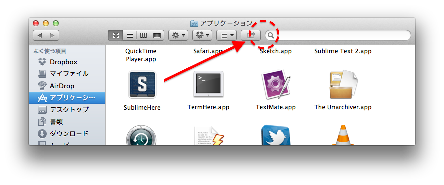
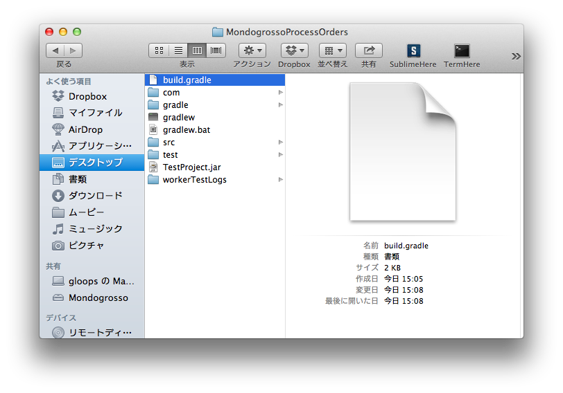
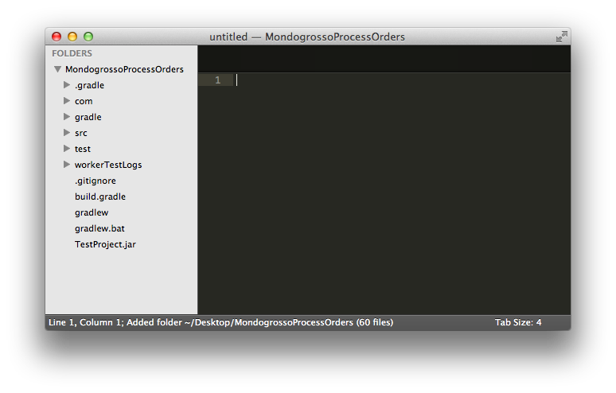

#SublimeHere

###The "Sublime Text" opener.
Open Sublime Text from finder with selecting the folder as "project".

###Usage
1. copy "SublimeHere" to your Application folder.
2. D&D "SublimeHere" towards Finder's bar.

 That's all.
 
 
###when click
The folder will be opend by Sublime Text as the project(not actually "project").

###limitation
curenntly the path of "Sublime Text" app is "/Application/Sublime Text".
This means "Open Sublime Text 3".

written in SublimeHere.app/Contents/Resources/Scripts/**main.scpt**.

if you wanna use this with Sublime Text 2, change these description.